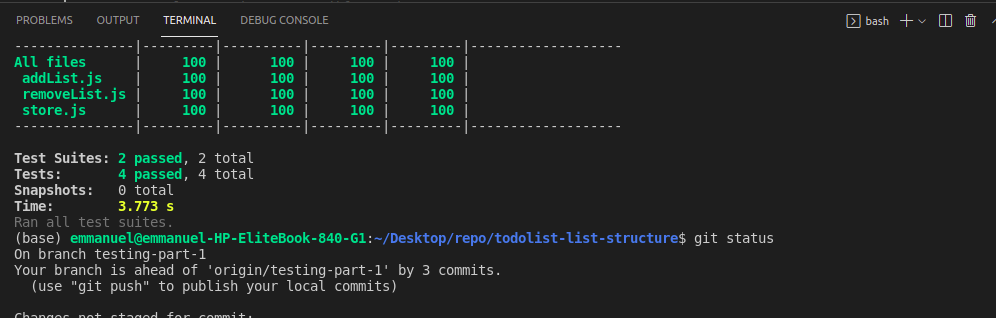

# Project Name
 To do list Application Jest Testing

 

## Built With

- Major languages (HTML, CSS, JavaScript)
- Frameworks (None)
- Technologies used - Webpack(Code Bundlng et al), Git(version control), ESLint(JavaScript linting), WebHint(linting tool), Stylelint(style linting), Jest testing tool

 
 ## Live Demo

[View Live Demo Site](https://gbengacode.github.io/todolist-list-structure/dist/)

## Getting Started

To get a local copy up and running follow these simple example steps.

### Prerequisites
 - A text editor(preferably Visual Studio Code)
### Install
  -  [Git](https://git-scm.com/downloads)
  -  [Node](https://nodejs.org/en/download/)
### Usage
  - Clone the repository using  ``` git@github.com:Gbengacode/todolist-list-structure.git ```
  -  cd into the project folder
  -  Run ``` npm install ```
  -  Run ``` npm run build ```
  -  Run ``` npm start ```

## Author
👤 **Author**

[Github](https://github.com/gbengacode)
[Linkedin](https://www.linkedin.com/in/emmanuel-gbenga/)

👤 **Ranjeet Singh**

- GitHub: [@githubhandle](https://github.com/thecodechaser) 
- Twitter: [@twitterhandle](https://twitter.com/thecodechaser) 
- LinkedIn: [LinkedIn](https://linkedin.com/in/thecodechaser) 
  
## 🤝 Contributing

Contributions, issues, and feature requests are welcome!


## Acknowledgments
coding partner